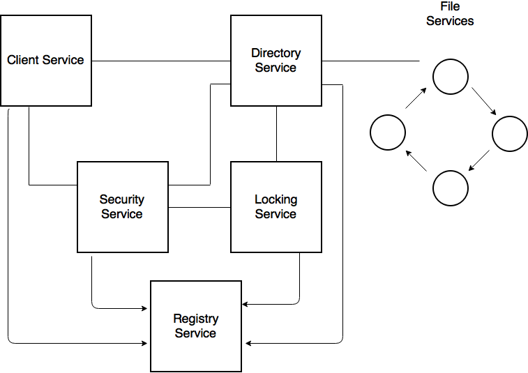

# Distributed File System

A Distributed File System compromising of many REST services. The core services are written in 
<a href="http://elixir-lang.org">Elixir<a> with the <a href="http://www.phoenixframework.org">Phonenix Framework</a>.
The services are capable of existing on physically seperate machines while working together in a true distributed fashion.

The entire system provides a distributed file system that can be utilised through a web client. 
The web client uses user accounts and cookie based authentication. 
The features of the distributed file system include typical file storage, sharing and 
locking all through a full replicated and encrytped set of file servers.

# Services

The system is compromised of 6 services. Clicking on the service name will link to that service's readme which will explain in much more details the features of each service.
<ul>
<li><a href="https://github.com/CalvinNolan/Distributed-File-System/tree/master/client_service"><b>Client Service</b></a> - The client service's readme will cover: single page applications, asynchronous user authentication, hadnling file contents.</li>
  <li><a href="https://github.com/CalvinNolan/Distributed-File-System/tree/master/client_service"><b>Directory Service</b></a> - The directory service's readme will cover: file servers management, file replication, caching, sharing and updating files, creating and deleting files.</li>
  <li><a href="https://github.com/CalvinNolan/Distributed-File-System/tree/master/client_service"><b>File Service</b></a> - The file service's readme will cover: file storage, transporting files.</li>
  <li><a href="https://github.com/CalvinNolan/Distributed-File-System/tree/master/client_service"><b>Security Service</b></a> - The security service's readme will cover: cookie based user authentication, user accounts, authenticating tokens, persistent sessions.</li>
  <li><a href="https://github.com/CalvinNolan/Distributed-File-System/tree/master/client_service"><b>Lock Service</b></a> - The lock service's readme will cover: locking tokens, managing user access.</li>
  <li><a href="https://github.com/CalvinNolan/Distributed-File-System/tree/master/client_service"><b>Registry Service</b></a> - The registry service's readme will cover: organising and maintaining services.</li>
</ul>

Each service's implementation exists in it's own folder in the repo with it's own readme explaining the design behind the service.

# Overall Architecture

Each of the services rely on each other to provide some feature set to the user. All user input and interaction comes through the client service as a web application which provides an easy interface to use.

Every request to and from each service is encrypted with an identical encryption and decryption function to ensure the contents of the request and response can't be read by others on the same network. Although only a simple encryption algorithm is used for this system, a clear and accessible place for implementing a much more sophisticated security protocol is provided. 

Each service registers itself with the registry service upon startup to provide a place for dynamic service replacement and management if a service fails or dies.

The client, directory and locking service all heavily use the security service for user authentication and ensuring data is only sent to the correct users. This service generates authentication tokens and initially assigns them to each user through their web cookies. This auth token is then required for each subsequent request that requires authentication.

The directory service encapsulates file management, advanced replication and caching. The directory service manages the connected file services and indexes references to all the stored files and the servers storing them. The directory service also enforces locking and sharing of these files through the locking service.

The file service is a single instance of many file servers that automatically connect together through management from the directory service. Each file service stores it's own files as assigned by the directory service and also backups up the contents of another file service. When a file service dies, the directory service executes advanced replication and backup to rectify the contents of the failed file service.

The locking service is a server used primarily by the directory service to enfore file write access to a single user at any time. Similar to the authentication service, the locking service provides tokens that are assigned to a single specfice user that represent a file's write access.

# Installation

Follow the steps here to install Phoenix: <a href="http://www.phoenixframework.org/docs/installation">http://www.phoenixframework.org/docs/installation</a>
 
This guide will also step you through installing Elixir, Erland and PostgreSQL, all are neccessary for running the distributed file system.
  
Laslty install Node.js by following thse steps: <a href="https://nodejs.org/en/download/package-manager/">https://nodejs.org/en/download/package-manager/</a>

# Screenshots

Here are some screenshots of what the Distributed File Service looks like.

  
  
The homepage when a user has logged in.

  
  
An example of some uploaded files as presented to a user.

  
  
  
The homepage when not logged in.

 

